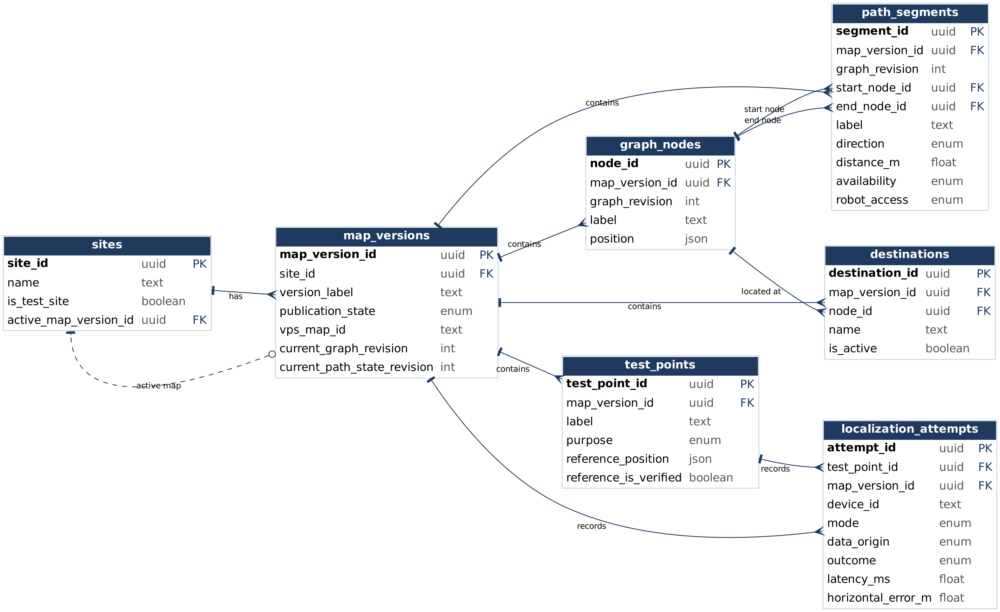

# 1. Data Definitions V2

This section expands the M1 data definitions into full field-level definitions. The same names are used in the database, API JSON, UI labels, UML and code. Each entity is tagged **[M2]** if it is used in the M2 demo or vertical prototype, **[M2 partial]** if only part of it is used in M2, or **[Planned]** if it is built in M3–M5. Planned entities are still fully defined here because they are part of the full design.

## 1.1 Conventions

| Convention | Definition |
|---|---|
| Naming | `snake_case` in SQL and API JSON. |
| IDs | UUID. Every reference points to an existing record. |
| Time | `timestamptz` (UTC), ISO 8601 in the API. Displayed in local time. |
| Units | Positions and distances in meters; latency in milliseconds. |
| Missing data | `null`, never 0. Missing latency, pose or error is never stored as zero. |
| Enums | Fixed value lists; unknown values are rejected. |
| Text limits | Names/labels 120 chars; descriptions/reasons 1,000 chars. |
| Map scope | Every spatial record belongs to one map version; linked records must share it. |

**Shared values**

| Value | Definition |
|---|---|
| `position` | `{x_m, y_m, z_m}` in world meters. |
| `orientation` | Quaternion `{x, y, z, w}`, normalized. |
| `world_frame` | Object `{frame_id` (text), `origin_description` (text), `handedness` (`right`), `up_axis` (`y`), `units` (`meters`)`}`. Right-handed, Y up, X/Z horizontal. Stored on each map version. |
| `pose` | `{position, orientation}` in one named frame. |
| `route_step` | `{segment_id, from_node_id, to_node_id}` (UUIDs); gives the travel direction explicitly. |

**How coordinates line up**

| Data | Frame | How it gets into the world frame |
|---|---|---|
| Scaniverse 3D model | Model frame | Defines the world frame for the map version (identity transform). |
| Graph nodes, destinations | World frame | Read directly from points on the 3D model, so no conversion is needed. |
| Test points | World frame | The **location** is picked on the model. The **reference position** used to measure accuracy is measured independently on site, not taken from the model (1.8). |
| iPhone pose from VPS | VPS site frame | Converted to the world frame with a source → world transform. **In M2** the transform is recorded manually in a config file in the repo and checked at several known points (at least 3, spread across the area). **From M3** it is stored in `frame_transforms` (1.12). |

## 1.2 Users and roles [Planned]

The application roles from M1 are kept. Accounts and passwords are managed by Supabase Auth and never stored in application tables. Permissions are enforced by the backend and database row-level security, not by the UI.

| Role | Can do |
|---|---|
| `visitor` | View environment and destinations; navigate; see own session, pose and route. |
| `developer` | Visitor abilities, plus run localization attempts and labeled simulation/replay, and view site evaluation results. |
| `operator` | Visitor abilities, plus edit destinations and paths, open/close segments, set robot access, review agent reports. |
| `administrator` | Manage accounts, site memberships, site configuration and map publication. |

`user_profiles`

| Field | Type | Notes |
|---|---|---|
| `user_id` | UUID | Same as the Supabase Auth user ID |
| `display_name` | text | Shown in the app, max 120 chars |
| `created_at` | timestamp | |

`site_memberships`

| Field | Type | Notes |
|---|---|---|
| `membership_id` | UUID | |
| `user_id` | UUID | Links to `user_profiles` |
| `site_id` | UUID | Site the role applies to |
| `role` | enum | `visitor`, `developer`, `operator`, `administrator`; one active role per user per site |
| `is_active` | boolean | False = access removed |
| `created_at` | timestamp | |

## 1.3 Site [M2]

`sites`: physical pilot area.

| Field | Type | Notes |
|---|---|---|
| `site_id` | UUID | |
| `name` | text | e.g. pilot building area |
| `description` | text | Area covered |
| `is_test_site` | boolean | `true` for seeded test data |
| `active_map_version_id` | UUID, nullable | Published map used by default |
| `created_at`, `updated_at` | timestamp | |

## 1.4 Map version [M2]

`map_versions`: one captured version of a site.

| Field | Type | Notes |
|---|---|---|
| `map_version_id` | UUID | |
| `site_id` | UUID | Owning site |
| `version_label` | text | Unique per site |
| `publication_state` | enum | `draft`, `published`, `retired` |
| `world_frame` | object | See 1.1 |
| `visual_asset_id` | UUID, nullable | Displayed 3D model (see 1.12) |
| `vps_map_id` | text, nullable | Niantic localization map ID; separate from the visual asset |
| `vps_status` | enum | `not_configured`, `draft`, `production`, `unavailable` |
| `current_graph_revision` | integer | Topology version |
| `current_path_state_revision` | integer | Open/closed and robot-access version |
| `captured_at`, `published_at` | timestamp, nullable | |

The visual model is what users see; the VPS map is what the phone localizes against. They are stored separately and aligned through a frame transform (1.12).

## 1.5 Graph nodes [M2]

`graph_nodes`: waypoints that path segments and destinations connect to.

| Field | Type | Notes |
|---|---|---|
| `node_id` | UUID | |
| `map_version_id` | UUID | |
| `graph_revision` | integer | |
| `label` | text | e.g. "Hallway B east end" |
| `position` | position | World meters |

## 1.6 Path segments [M2]

`path_segments`: walkable connections between two nodes.

| Field | Type | Notes |
|---|---|---|
| `segment_id` | UUID | |
| `map_version_id`, `graph_revision` | UUID, integer | Same revision as both endpoints |
| `label` | text | Searchable, e.g. "Hallway B" |
| `start_node_id`, `end_node_id` | UUID | Different nodes |
| `direction` | enum | `bidirectional`, `start_to_end` |
| `distance_m` | number | Positive |
| `geometry` | array of position | Path points, at least 2 |
| `availability` | enum | `open`, `closed` |
| `robot_access` | enum | `allowed`, `restricted` |
| `last_state_revision` | integer | |
| `updated_at` | timestamp | |

A human route may use any **open** segment. A robot route may use only segments that are **open and robot-allowed**. Reopening a segment keeps its robot access rule.

## 1.7 Destinations [M2]

`destinations`: named places users can navigate to. The pilot has three, including Room 103.

| Field | Type | Notes |
|---|---|---|
| `destination_id` | UUID | |
| `site_id`, `map_version_id` | UUID | |
| `node_id` | UUID | Destination node in the same graph |
| `name` | text | Searchable |
| `description` | text | |
| `is_active` | boolean | Offered for new navigation |
| `updated_at` | timestamp | |

## 1.8 Test points [M2]

`test_points`: fixed physical camera positions used to evaluate localization. The pilot has five evaluation points. Points used for alignment are kept separate.

| Field | Type | Notes |
|---|---|---|
| `test_point_id` | UUID | |
| `map_version_id` | UUID | |
| `label` | text | Searchable, e.g. "TP3 lobby" |
| `purpose` | enum | `evaluation`, `alignment` |
| `reference_position` | position, nullable | Camera position measured independently on site (not taken from the model) |
| `reference_method` | text, nullable | How it was measured |
| `reference_uncertainty_m` | number, nullable | Never assumed 0 |
| `reference_is_verified` | boolean | Only verified points count toward error |
| `is_synthetic` | boolean | `true` for seeded test data |

## 1.9 Localization attempts [M2]

`localization_attempts`: one record per started localization attempt, including every failure and timeout. **Success** means a valid pose for the intended map within 30 seconds; accuracy is measured separately.

| Field | Type | Notes |
|---|---|---|
| `attempt_id` | UUID | Resending the same attempt record keeps its ID. Starting a new localization attempt creates a new ID. |
| `session_id` | UUID, nullable | Links to a session from M3 on; null for M2 seed data |
| `map_version_id`, `test_point_id` | UUID | |
| `device_id` | text | Pseudonymous device label |
| `sdk_version` | text, nullable | Null for synthetic data |
| `mode` | enum | `live`, `simulation`, `replay` |
| `data_origin` | enum | `live_sdk`, `synthetic`, `recorded` |
| `condition_label` | text | e.g. "daylight", "evening" |
| `camera_direction` | text | e.g. "facing north" |
| `started_at`, `ended_at` | timestamp | `ended_at` null while in progress |
| `outcome` | enum | `in_progress`, `success`, `timeout`, `tracking_loss`, `network_error`, `map_mismatch`, `cancelled`, `other_failure` |
| `latency_ms` | number, nullable | Success only |
| `failure_reason` | text, nullable | Required for failures |
| `valid_pose_sample_id` | UUID, nullable | Required for live success from M3 on |
| `horizontal_error_m` | number, nullable | X/Z distance to verified reference |
| `error_is_valid` | boolean | False for synthetic data |
| `received_at` | timestamp | Server receipt time |

Horizontal error = √((pose.x − ref.x)² + (pose.z − ref.z)²). Synthetic and replayed attempts never count as live evidence.

## 1.10 Sessions and pose samples [Planned]

A **session** groups one device's live, simulation or replay data. A **pose sample** is one position report from the phone.

`navigation_sessions`

| Field | Type | Notes |
|---|---|---|
| `session_id` | UUID | |
| `user_id` | UUID, nullable | Null only for seeded test sessions |
| `site_id`, `map_version_id` | UUID | Map is fixed for the whole session |
| `device_id` | text | Pseudonymous device label |
| `device_model` | text | e.g. "iPhone 15"; `synthetic` for test data |
| `sdk_version` | text, nullable | Niantic SDK version used |
| `mode` | enum | `live`, `simulation`, `replay` |
| `data_origin` | enum | `live_sdk`, `synthetic`, `recorded` |
| `status` | enum | `active`, `ended`, `failed` |
| `started_at` | timestamp | |
| `ended_at` | timestamp, nullable | Null while active |

`pose_samples`

| Field | Type | Notes |
|---|---|---|
| `sample_id` | UUID | Retries reuse the same ID (no duplicates) |
| `session_id` | UUID | Owning session |
| `provider_map_id` | text, nullable | VPS map the phone localized against |
| `provider_pose` | pose, nullable | Raw pose in the VPS site frame |
| `transform_id` | UUID, nullable | Transform used to convert it (1.12) |
| `world_position` | position, nullable | Converted position; null if no valid pose |
| `world_orientation` | orientation, nullable | Converted orientation |
| `tracking_status` | enum | `localizing`, `valid`, `lost`, `unavailable` |
| `captured_at` | timestamp | Time on the phone |
| `received_at` | timestamp | Time on the server |

A pose older than 5 seconds, or with tracking not `valid`, is **stale** and cannot start a new live route.

## 1.11 Routes [M2 partial] and simulated agent [Planned]

**In M2**, the route API computes a route from a manually chosen start node to a destination and returns it to the viewer; it is not stored. **From M3**, routes are stored in `routes` so they can be invalidated and replanned.

Route (API response in M2, `routes` table from M3)

| Field | Type | Notes |
|---|---|---|
| `route_id` | UUID | M3+ (stored routes only) |
| `session_id` | UUID, nullable | M3+ |
| `map_version_id` | UUID | |
| `graph_revision`, `path_state_revision` | integer | Graph and open/closed state used |
| `start_node_id` | UUID, nullable | M2: chosen by hand |
| `start_position` | position, nullable | M3+: live position used as the start |
| `start_segment_id` | UUID, nullable | M3+: walkable segment the live start is attached to |
| `destination_id` | UUID | |
| `profile` | enum | `human`, `robot` |
| `steps` | array of route_step | Ordered path; empty if unreachable |
| `total_distance_m` | number, nullable | Null if unreachable |
| `status` | enum | `valid`, `invalidated`, `unreachable`, `arrived` |
| `created_at` | timestamp | |

`simulated_agents` [Planned]

| Field | Type | Notes |
|---|---|---|
| `agent_id` | UUID | |
| `session_id` | UUID | Simulation-mode session only |
| `route_id` | UUID, nullable | Current route |
| `position` | position | Current position on its path |
| `current_step_index` | integer, nullable | Index into the route's steps |
| `step_progress_m` | number | Distance along the current step |
| `speed_mps` | number | Configured simulation speed (> 0) |
| `state` | enum | `idle`, `running`, `paused`, `waiting_for_operator`, `arrived`, `unreachable` |
| `updated_at` | timestamp | |

A live start is accepted only if it is within `max_start_distance_m` (a site setting, agreed after first tests) of a walkable segment on the same map version, and the pose is not stale; otherwise the start is rejected with an error. The robot is always labeled SIMULATED in the UI. When a segment's availability or robot access changes, affected routes are invalidated and replanned, or marked unreachable.

## 1.12 Visual assets [M2 partial] and alignment [Planned]

**In M2**, the Scaniverse model file (GLB) is stored in Supabase Storage and loaded by the viewer, and the VPS → world transform is kept in a config file (1.1). Both move into these tables in M3.

`visual_assets`

| Field | Type | Notes |
|---|---|---|
| `asset_id` | UUID | |
| `map_version_id` | UUID | |
| `asset_kind` | enum | `mesh`, `preview_image` |
| `storage_path` | text | Supabase Storage key |
| `file_format` | enum | `glb`, `png`, `jpeg`, `webp` |
| `byte_size` | integer | Must be within the limit below |
| `checksum_sha256` | text | 64 hex characters |
| `license_reference` | text | Who captured it / permission source |
| `created_at` | timestamp | |

`frame_transforms`

| Field | Type | Notes |
|---|---|---|
| `transform_id` | UUID | |
| `map_version_id` | UUID | |
| `source_frame_id` | text | e.g. VPS site frame |
| `target_frame_id` | text | The map's world frame |
| `matrix_4x4` | array of 16 numbers | Row-major source → world transform; must be invertible |
| `validation_status` | enum | `unverified`, `verified`, `rejected` |
| `verified_at` | timestamp, nullable | |
| `verification_notes` | text | Which known points were checked and the error found |

| Asset | Format | Max size |
|---|---|---|
| 3D mesh | GLB | 100 MB |
| Images | PNG, JPEG, WebP | 10 MB |
| Video | Not stored | n/a |

Total spatial asset storage stays within the 1 GB budget from M1. Raw camera recordings are not stored. Live navigation uses only `verified` transforms.

## 1.13 Path events, simulated obstacles and agent reports [Planned]

`path_events`

| Field | Type | Notes |
|---|---|---|
| `event_id` | UUID | |
| `map_version_id`, `segment_id` | UUID | |
| `actor_user_id` | UUID | Operator or admin who made the change |
| `event_type` | enum | `availability_change`, `robot_access_change` |
| `old_value`, `new_value` | text | Must be valid values of that field; must differ |
| `reason` | text | |
| `path_state_revision` | integer | New map-wide revision number |
| `source_report_id` | UUID, nullable | Agent report that caused it, if any |
| `committed_at` | timestamp | |

`agent_reports`

| Field | Type | Notes |
|---|---|---|
| `report_id` | UUID | |
| `agent_id`, `segment_id` | UUID | |
| `reason` | text | Tester-injected simulated obstacle, not real sensing |
| `status` | enum | `pending`, `confirmed`, `rejected` |
| `reported_at` | timestamp | |
| `reviewed_by_user_id` | UUID, nullable | Required once reviewed |
| `reviewed_at` | timestamp, nullable | |
| `closure_event_id` | UUID, nullable | Required when confirmed |

`simulated_obstacles`

| Field | Type | Notes |
|---|---|---|
| `obstacle_id` | UUID | |
| `session_id` | UUID | Simulation session |
| `segment_id` | UUID | Edge the tester blocked |
| `placed_by_user_id` | UUID | Tester who placed it |
| `is_active` | boolean | Set false when dismissed |
| `placed_at` | timestamp | |
| `dismissed_at` | timestamp, nullable | |

When the robot reaches the node before an edge with an active obstacle, it stops (`waiting_for_operator`) and creates an agent report. **Confirm:** the edge closes and routes replan. **Reject:** the obstacle is dismissed (`is_active = false`) and the robot resumes if its route is still valid. A pending report never closes a path. Confirmation creates exactly one closure event; confirming twice creates no duplicate. Stale writes are rejected.

## 1.14 Metric snapshot and localization health [Planned]

`metric_snapshots`

| Field | Type | Notes |
|---|---|---|
| `snapshot_id` | UUID | |
| `test_point_id`, `map_version_id` | UUID | Health is per point, device and map |
| `device_id` | text | |
| `attempt_ids` | array of UUID | Exact attempts used |
| `attempt_count` | integer | All live attempts, including failures |
| `success_count` | integer | |
| `success_rate` | number, nullable | 0–1; null if no attempts |
| `median_latency_ms` | number, nullable | Successful attempts only |
| `valid_error_count` | integer | Attempts with a valid reference error |
| `median_horizontal_error_m` | number, nullable | Null if no valid errors |
| `health_status` | enum | `gray`, `red`, `yellow`, `green` |
| `calculated_at` | timestamp | |

Health uses only **live** attempts from the same test point, device and map version. Apply the rules in order:

| Order | Status | Rule |
|---|---|---|
| 1 | Gray | Fewer than 10 attempts |
| 2 | Red | ≥10 attempts **and** success below 60% |
| 3 | Red | ≥10 attempts **and** ≥5 valid error samples **and** median error above 1.5 m |
| 4 | Gray | ≥10 attempts but fewer than 5 valid error samples |
| 5 | Green | ≥10 attempts, ≥5 valid error samples, success ≥80% **and** median error ≤1 m |
| 6 | Yellow | All other cases |

Counts are always shown with the status. Health describes tested positions only, not map freshness.

## 1.15 AI summaries and exports [Planned]

`ai_summaries`

| Field | Type | Notes |
|---|---|---|
| `summary_id` | UUID | |
| `snapshot_id` | UUID | Metrics the summary explains |
| `requested_by_user_id` | UUID | |
| `model_version`, `prompt_version` | text | |
| `status` | enum | `pending`, `completed`, `failed`, `timed_out` |
| `observations` | array of `{text, metric_fields, attempt_ids}` | Each claim cites its source |
| `suggestions` | array of text | Labeled separately from observations |
| `requested_at` | timestamp | |
| `completed_at` | timestamp, nullable | |

`attempt_exports`

| Field | Type | Notes |
|---|---|---|
| `export_id` | UUID | |
| `requested_by_user_id` | UUID | |
| `filters` | object | Test point, outcome, mode, date range used |
| `file_format` | enum | `csv`, `json` |
| `row_count` | integer | |
| `generated_at` | timestamp | |

Gemini receives only aggregate metrics and attempt IDs, never camera data. All numbers are computed by the server; generated numbers that don't match the snapshot are rejected. The dashboard keeps working if Gemini fails (15-second timeout).

## 1.16 Relationships

- A **site** has map versions; a **map version** owns its graph nodes, path segments, destinations, test points, assets and transforms.
- A **path segment** connects two graph nodes in the same graph revision; a **destination** points to one node.
- A **localization attempt** belongs to one test point and map version (and to a session from M3 on).
- A **route** uses ordered path segments from one graph revision and one path-state revision.
- An **agent report** targets one path segment; confirmation links it to one **path event**.
- A **metric snapshot** records the exact attempts it was computed from; an **AI summary** cites one snapshot.
- History is preserved: attempts, events and referenced map versions are retired, not deleted.

*Figure 1.1: M2 prototype data model (key fields).*

## 1.17 Traceability to M1

| M1 data concept | Section | Requirements |
|---|---|---|
| User and role | 1.2 | R1, R7, R8, R18 |
| Site and map version | 1.3–1.4 | R2–R4, R7 |
| Navigation graph | 1.5–1.6 | R5–R10, R17 |
| Destination | 1.7 | R2, R5, R7 |
| Test point and reference | 1.8 | R12–R14 |
| Localization attempt | 1.9 | R12–R15 |
| Session and pose sample | 1.10 | R3–R4, R6, R11 |
| Route and simulated agent | 1.11 | R5, R9–R11, R17 |
| Visual asset and transform | 1.12 | R2–R3 |
| Path event and report | 1.13 | R8–R9, R17–R18 |
| Metric summary and health | 1.14 | R13–R14 |
| AI summary | 1.15 | R16 |
